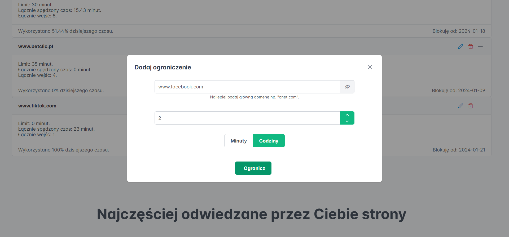
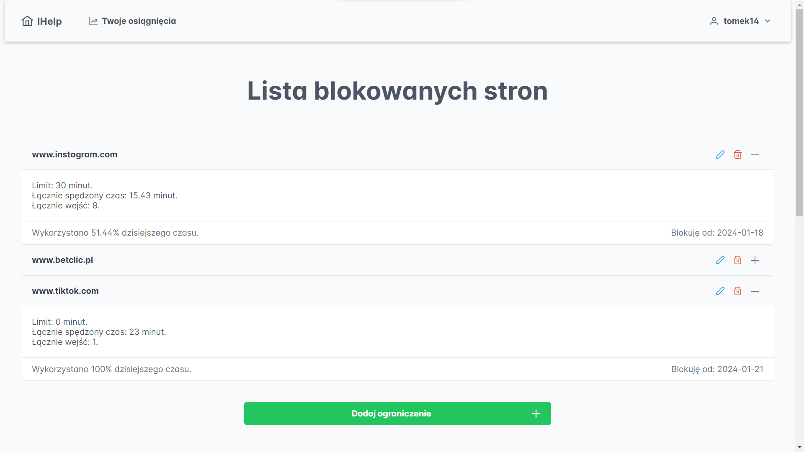
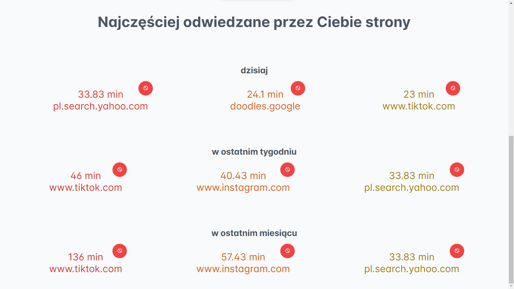
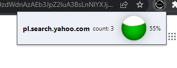

***BITEHACK 2024***

This year's motive was "Confronting addictions" and we came up with creating a smart **extension for Chrome** browser.
The extension allows users to set boundaries on problematic web pages such as Facebook, Instagram etc. to count the time spent on them and disallow spending more or even completely block them. Using **React(Vite + Typescript)** and **Vue** we created two fronts (whichever suits you better) to set the timers on webpages

and trach your progress!

You can check the time left when you're using the webpage without leaving it or opening extra tab thanks to our slick dynamic widget:

From technicalities it's worth mentioning that we (of course) made backend with **Django** and **MySQL** database.

Thanks to Marek, Szymon and Igor for 24h of coding and a great time spent on Hackaton, don't forget to check up their github profiles to!
